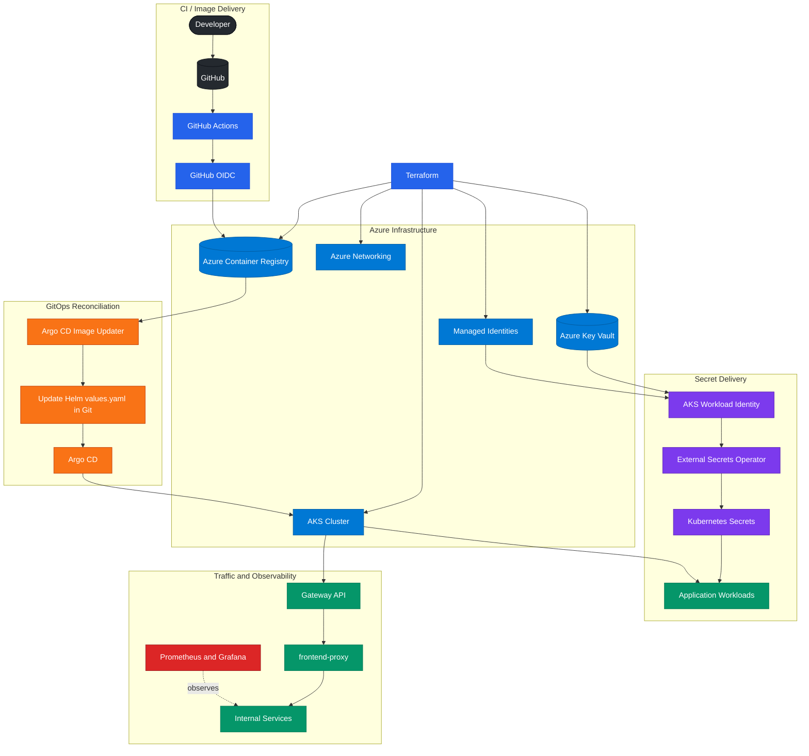
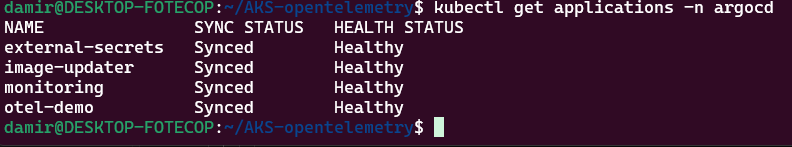
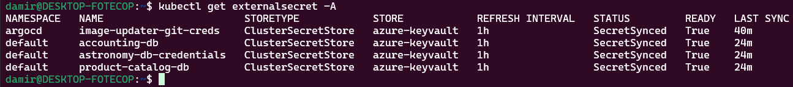
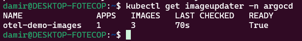
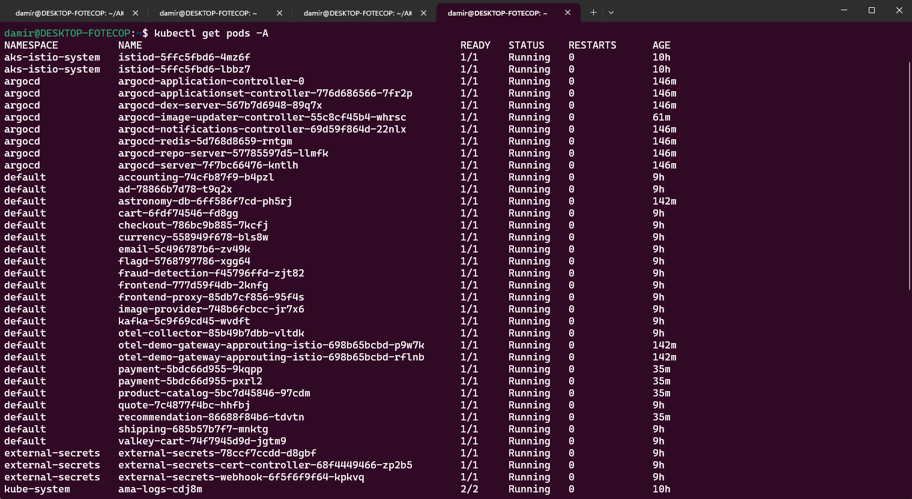

# AKS OpenTelemetry GitOps Platform

A production-style Azure Kubernetes Service and DevOps portfolio project built
around selected OpenTelemetry Demo services. It focuses on reproducible cloud
infrastructure, secure CI/CD, GitOps delivery, observability, and day-to-day
Kubernetes platform operations.

## Future Improvements

This is a production-style project, not a production-ready platform. It was
built under Azure trial and quota constraints, so some improvements were
intentionally left for future iterations.

### CI/CD

The current pipeline provides service-specific validation, GitHub OIDC
authentication, immutable Git SHA tagging, and image publishing to ACR. Future
improvements include:

- Real unit/integration tests, Trivy scanning, Docker Buildx layer caching, and
  dependency caching
- Terraform/Helm pull-request validation and optional image signing or broader
  software supply-chain controls

The Azure environment was decommissioned before these changes could be
validated end-to-end against ACR and AKS.

### High Availability

The AKS environment used one worker node because the Azure trial was limited to
a 4-vCPU quota. A production deployment would use multiple nodes, availability
zones where supported, topology spread or anti-affinity, suitable replica
counts and PodDisruptionBudgets, and appropriately scaled node pools. The Helm
chart includes HPA and PDB support, but node-level high availability could not
be demonstrated within the available quota.

## Architecture



## Technologies

| Area | Technologies |
| --- | --- |
| Cloud / IaC | Azure, Terraform, AKS, ACR, Azure Key Vault |
| Kubernetes / Platform | Kubernetes, Helm, Gateway API, HPA and PDB templates, NetworkPolicy, External Secrets Operator |
| CI/CD / GitOps | GitHub Actions, GitHub OIDC, Argo CD, Argo CD Image Updater |
| Observability | OpenTelemetry Collector, Prometheus, Grafana, kube-state-metrics, node-exporter |
| Custom services | Product Catalog (Go), Payment (Node.js), Recommendation (Python) |

## What the Project Implements

- Modular Terraform for AKS, ACR, Key Vault, networking, managed identities,
  federated credentials, and scoped Azure RBAC.
- AKS Workload Identity for External Secrets Operator and Argo CD Image Updater,
  without static Azure credentials in Kubernetes.
- Key Vault-backed secrets synchronized into Kubernetes by External Secrets
  Operator.
- Service-specific GitHub Actions validation and OIDC-authenticated image pushes
  to ACR using immutable full Git commit SHA tags.
- Helm deployment of the OpenTelemetry application stack, including the three
  custom-built services.
- Argo CD App-of-Apps bootstrap with automated synchronization, pruning, and
  drift self-healing.
- Argo CD Image Updater discovery of new ACR images and Git write-back to the
  application values file.
- kube-prometheus-stack monitoring with Prometheus, Grafana,
  kube-state-metrics, node-exporter, and Alertmanager.
- Gateway API routing through `frontend-proxy`; the chart also contains
  conditional HPA, PDB, and NetworkPolicy templates, with PostgreSQL network
  policy enabled in the current values.

## CI/CD Flow

1. A developer pushes a change to a custom service.
2. Its service-specific GitHub Actions validation runs.
3. On `main`, Docker builds the image and tags it with the full Git SHA.
4. GitHub authenticates to Azure through OIDC.
5. The image is pushed to ACR.
6. Argo CD Image Updater detects the new eligible SHA tag.
7. Image Updater writes the tag to `helm/otel-demo/values.yaml` in Git.
8. Argo CD reconciles the Helm release into AKS.

GitHub Actions builds and publishes images; it does **not** deploy directly to
the cluster.

## Security

- GitHub OIDC replaces long-lived Azure client secrets in CI.
- AKS Workload Identity gives workloads federated access to Azure resources.
- Azure Key Vault remains the source of truth for secret values, while External
  Secrets materializes the required Kubernetes Secrets.
- Dedicated identities receive scoped roles such as `AcrPush`, `AcrPull`, and
  `Key Vault Secrets User`.
- Custom images use immutable 40-character Git SHA tags.
- Third-party Helm charts managed by child Applications are pinned to explicit
  versions.

## GitOps

Git is the desired-state source. The `platform-root` Argo CD Application watches
the child Application manifests in `platform/argocd/applications/`, which manage:

- `otel-demo` — the application Helm chart in `helm/otel-demo/`
- `external-secrets` — the ESO chart and repository platform configuration
- `monitoring` — the pinned kube-prometheus-stack chart and custom values
- `image-updater` — the controller, ACR authentication, Git credentials, and
  image update policy

Each child Application uses automated synchronization with `prune` and
`selfHeal` enabled.

## Screenshots

### Argo CD Applications



### External Secrets



### Image Updater



### AKS Workloads



## Repository Structure

```text
.
├── terraform/
├── helm/otel-demo/
├── platform/
├── src/
├── .github/workflows/
└── docs/
```

## What This Project Demonstrates

- Infrastructure as Code and reproducible Azure environments
- Kubernetes platform engineering and operational controls
- Secure, identity-based CI/CD and secret management
- GitOps-driven deployment and image promotion
- OpenTelemetry-based observability and platform troubleshooting
